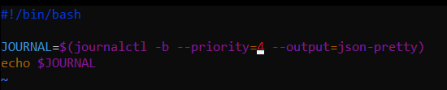

# Exam_2420
###### Cloue M.
---
#### PART 1
How could you update most of the software on your Ubuntu OS? 

```apt update```

```apt updgrade```

#### PART 2
Fix the code with vim

```
if [ $# -eq 1 ] ; then
  eco "Usage: $0 temperature[F|V|K]
        where the suffix:
        F    indicates input is in Fahrenheit (default)
        V    indicates input is in Celsius
        K    indicates input is in Kelvin"
   exit 1
fi

unit="$(eco $1|sed -e 's/[-[numbs]]*//g' | tr '[:lower:]' '[:upper:]' )"
temp="$(eco $1|sed -e 's/[^-[:digit:]]*//g')"
```


#### PART 3
journalctl is used to query journals written by journald. In other words the primary tool for interacting with logs in Linux OSs that use systemd.

Using the man page for journalctl write a journalctl command that does the following:
- print logs for the current boot
- logs should have a priority of warning or more important
- output in a nice pretty json.


#### PART 4
Finding users in the system with UID between 1000 and 5000 with USERNAME, UID and SHELL

```
#!/bin/bash

# Get a list of all the users on the system
users=$(cut -d: -f1 /etc/passwd)
echo 'Regular users on the system are:'

# Loop through the list of users.
for user in $users
do
        uid=$(id -u $user)
        shell=$(grep "^$user:" /etc/passwd | cut -d: -f7)
        if [ $uid -ge 1000 ] && [ $uid -le 5000 ];then
                # Print the username and UID
                echo "$user $uid $shell"
        fi
done

echo 'Users currently logged in are:'
# Get a list of all the logged in users
logged_in_users=$(who)

# Loop through the list of logged in users and print their names
for user in $logged_in_users
do
  # Extract the username from the who output
  username=$(echo $user |awk '{print $0}')

  # Print the username
  echo $username
done
```

#### PART 5
