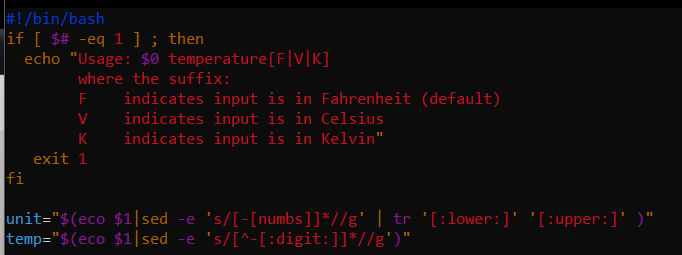

# Exam_2420
###### Cloue M.
---
#### PART 1
How could you update most of the software on your Ubuntu OS? 

```apt update```

```apt updgrade```

#### PART 2
Fix the code with vim

```
if [ $# -eq 1 ] ; then
  eco "Usage: $0 temperature[F|V|K]
        where the suffix:
        F    indicates input is in Fahrenheit (default)
        V    indicates input is in Celsius
        K    indicates input is in Kelvin"
   exit 1
fi

unit="$(eco $1|sed -e 's/[-[numbs]]*//g' | tr '[:lower:]' '[:upper:]' )"
temp="$(eco $1|sed -e 's/[^-[:digit:]]*//g')"
```

